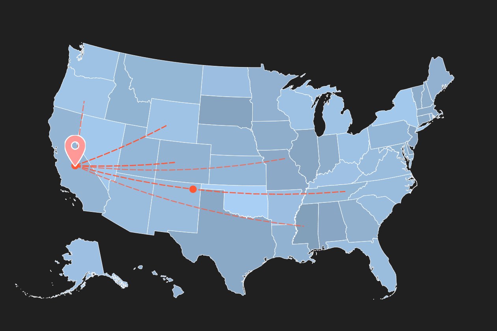

# Dynamic Impact Map Frontend

The Dynamic Impact Map is an interactive visualization tool that showcases a Pastor's cumulative engagement across the United States. It displays the flow of engagement from the Pastor's headquarters to various states, providing a representation of their impact and reach.

## Running the project

1. install dependencies with `npm install` or `yarn install`
2. Point the `.env.local` file to the backend server
3. run the project with `npm run dev` or `yarn dev`
